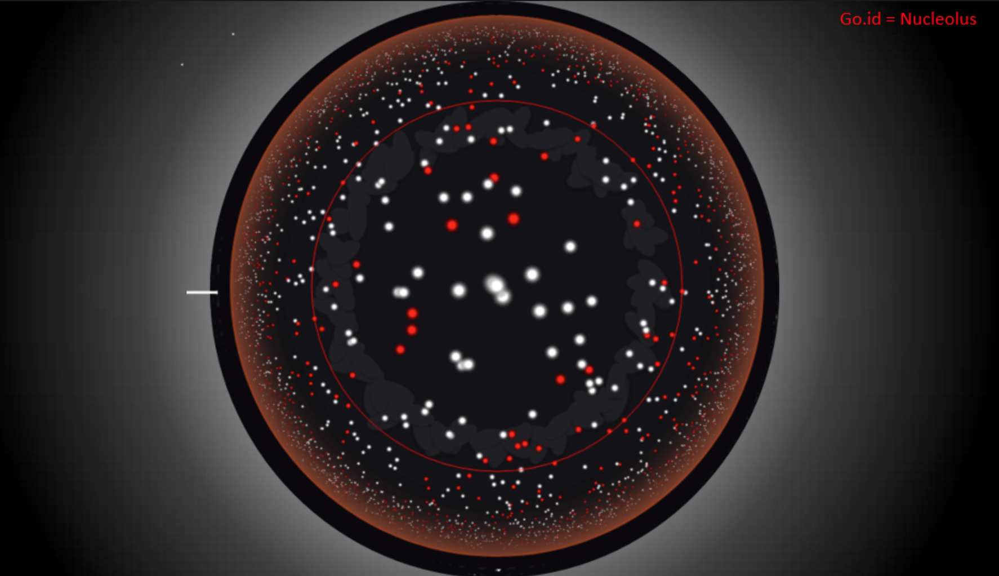

# HUMAN UNIQUENESS MAP

The topic of the 2018 BCB BioHacks bioinformatics hackathon was exploring the question "What makes us human?"

This solution consists of 2 components:
 - Comparison of the human genome to the 4 closest primates (orangutan, gorilla, chimpanzee, and bonobo)
 - Development of a 1D visualisation tool for Gene Ontology (GO) data for genes that were found to have variants unique to humans

1D visualisation tool plots genes based on selected GO terms with the genes that are most enriched for the given term being in the centre of the image and those that are less relevant on the outside. Additionally, it highlights genes that have variants unique to humans in red

For example, the image below is showing "Nucleolus" GO term and it has a lot of genes found to be unique to humans  



# Instructions

```bash
# for app, api:
# get node from nvm.sh
cd {app,api}
npm install
npm start
```
